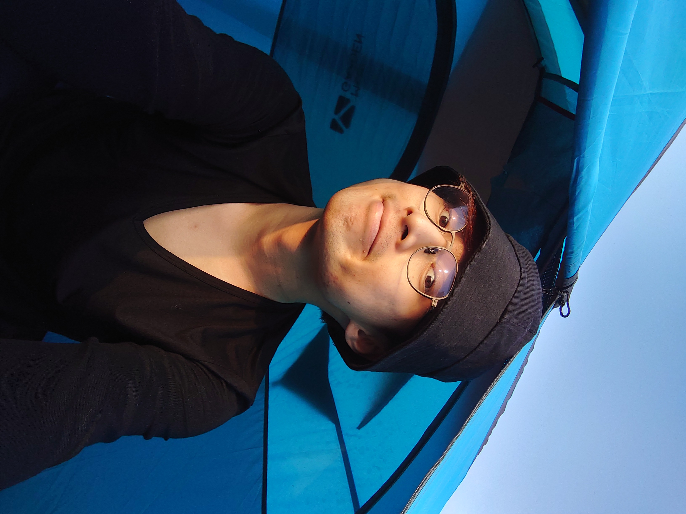

{: width="300px"}{: style="float: left; margin-right: 1em;"}

Born and raised in Hong Kong, I found my passion for unravelling the mystery of life to improving our health. My current work focuses on how muscle stem cells communicate with their neighbours during injury to repair damaged tissues. Besides, I am also intrigued to understand how we age and pave the way to rejuvenate. 

I enjoy outdoor activities much as doing science!
